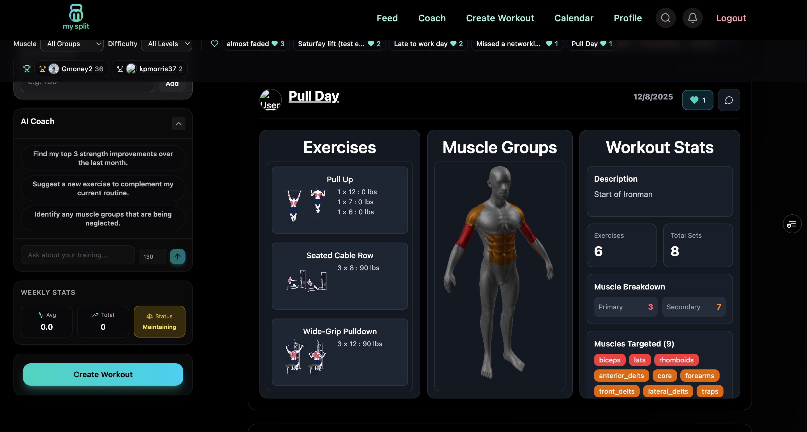

## Hi 👋

I’m a software engineer.  
Most of my work lives in private repos, but I want to spotlight **MySplit** — a project I actively design, build, and run end-to-end.

---

## MySplit — Workout Tracking for Lazy People (By Design)

  <!-- Core stack -->
  
  
  
  
  

  <!-- AI -->

  

🔗 **Live web app:** https://mysplit-dun.vercel.app/

  

Most workout apps fail for a simple reason:

> **Recording workouts takes too much effort.**

Typing sets, reps, weights, exercises, and notes *while you’re tired and sweaty* is friction-heavy.  
Over time, friction wins — and people stop logging altogether.

**MySplit flips this model.**  
The app is built around one core principle:

> **Recording a workout should never be harder than the workout itself.**

---

## The core idea: effort should be optional

MySplit is intentionally designed for **lazy users**.

You should be able to track:
- **Everything** (sets, reps, weights, exercises), or
- **Almost nothing** (“yes, I worked out”),  
…and still get value from the system.

Instead of forcing a single rigid input flow, MySplit supports **seven different recording mediums**, all normalized into the same structured backend.

---

## 7 ways to record a workout (from max detail → zero effort)

Users can choose *how much effort they want to spend* **every single day**.

### 1. Text
Natural language input.
> “Push day — bench 3x8 @ 185, incline DB 3x10, cable flys”

### 2. Audio
Talk between sets instead of typing.  
Perfect when hands are busy.

### 3. Video
Capture context when nothing else is practical.

### 4. Previous workouts
Reuse and slightly modify a past session in seconds.

### 5. Notes
Loose thoughts that persist and compound over time.
> “Felt strong today, shoulders slightly tight”

### 6. Manual selection
Traditional UI for users who want precision and structure.

### 7. **Single Tap (boolean logging)**
**“I worked out today.”** ✅

No exercises.  
No reps.  
No weights.  

Just a single tap that records **yes/no**.

This is intentional.

> The system is built to support **a spectrum of detail**,  
> from *full structured lifts* → *pure adherence tracking*.

The backend handles normalization so users never have to “pay” effort they don’t have that day.

---

## Why this is hard (and interesting)

Loose human input still needs to become:

- Clean
- Structured
- Queryable
- Comparable over time

MySplit is **AI-native** — the AI isn’t bolted on later.  
It is the interface between the user and the data model.

Under the hood, the app turns:
- Natural language
- Partial information
- Ambiguous intent  
into **validated, structured writes** across workouts, activities, plans, and body metrics.

---

## The LangGraph agent (at the center of everything)

MySplit’s coach is a **stateful, agentic system** built with **LangGraph**, not a single-shot chatbot.

At a high level, the agent:

- Accepts **messy, high-level user input**
- Plans before acting
- Loads *only* the context it needs (weights, workouts, Strava activity, plans)
- Routes intent through **schema-validated tools**
- Produces deterministic, debuggable state transitions

### Key architectural traits

- **Explicit state graph**
  - Zod-defined state (intent, confidence, history, context, final output)
  - Deterministic node transitions (agent → confidence → end)

- **Tool-first execution**
  - Every mutation (log workout, create plan, update weight, fetch Strava data) happens through a typed tool
  - No free-form database writes

- **Context-aware loading**
  - The agent dynamically decides whether to load:
    - Weights
    - Past workouts
    - Strava activities
  - Hard caps prevent context bloat and runaway token usage

- **Memory & replay**
  - Checkpointed execution with `thread_id`
  - Enables pause / resume, streaming, and traceability

- **Streaming + observability**
  - Token streaming to the UI
  - Node-level lifecycle events (`node_start`, `node_end`, `done`)
  - Failures are inspectable instead of opaque

This avoids the classic **“chatbot glued to a CRUD app”** trap and treats AI as a **first-class system component**.

---

## External APIs & integrations

This app is intentionally **not** self-contained — it coordinates multiple external systems.

### APIs in active use

- **OpenAI**
  - Natural language → structured workout plans
  - Agent reasoning, tool selection, and confidence scoring
  - Streaming responses for real-time UX

- **Strava**
  - OAuth authentication
  - Activity backfilling and incremental sync
  - Unified activity model (runs, rides, metrics) alongside strength data

- **Supabase**
  - Auth (session cookies)
  - Postgres database
  - Storage (avatars)
  - Row-level security

- **Redis**
  - Rate limiting
  - Shared cache for hot reads (profiles, feeds)
  - Middleware-level request hygiene

These integrations are coordinated through server-side API routes and tool boundaries — not client hacks.

---

## Platform support

MySplit exists as:
- A **Next.js web app**
- A **deployed React Native mobile app**

Both platforms share:
- The same backend
- The same data model
- The same LangGraph agent
- The same external API integrations

---

## Performance, correctness, and scale

This is a full-stack system optimized for real usage during workouts:

- **Caching**
  - React Query for client-side deduplication and background refresh
  - Redis for shared server cache

- **Optimistic UI**
  - Likes, follows, and social actions update instantly
  - All writes are idempotent and safe under retries

- **Database design**
  - Indexed feeds, social graphs, workouts
  - Triggers for derived fields and aggregates
  - Cheap reads under load

- **Rendering control**
  - Aggressive lazy loading
  - Hard limits on heavy `.glb` 3D muscle models to avoid GPU thrashing

- **Middleware**
  - Centralized auth, rate limiting, and validation
  - Keeps API routes predictable and secure

A lot of effort went into making the app feel **fast when users are tired**, which is where most fitness apps fail.

---

## Why I built this

MySplit isn’t just about fitness.

It’s about:
- Designing systems that respect human laziness
- Turning fuzzy input into structured data
- Shipping **agentic AI systems** that hold up under real use

If you’re curious, the live app is here:
👉 https://mysplit-dun.vercel.app/
